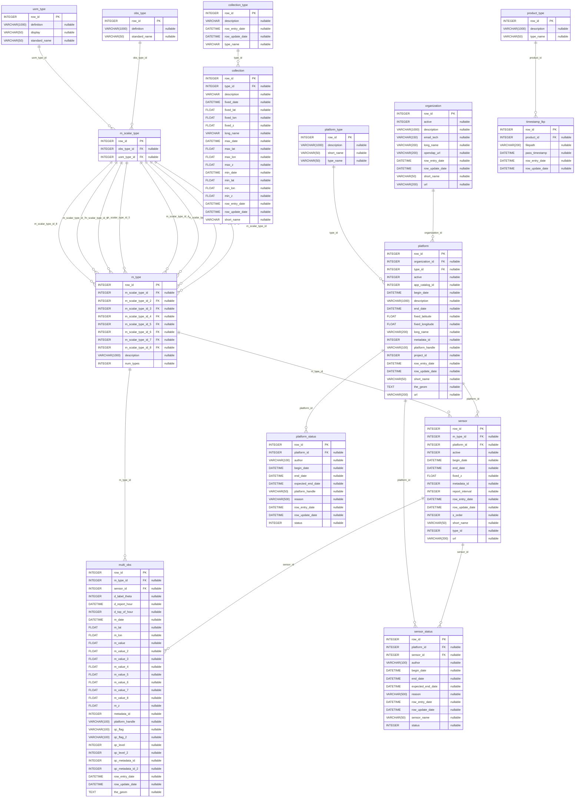

## Schema
<!-- BEGIN_SQLALCHEMY_DOCS -->

```mermaid

erDiagram
  organization {
    INTEGER row_id PK
    INTEGER active "nullable"
    VARCHAR(1000) description "nullable"
    VARCHAR(150) email_tech "nullable"
    VARCHAR(200) long_name "nullable"
    VARCHAR(200) opendap_url "nullable"
    DATETIME row_entry_date "nullable"
    DATETIME row_update_date "nullable"
    VARCHAR(50) short_name "nullable"
    VARCHAR(200) url "nullable"
  }

  collection_type {
    INTEGER row_id PK
    VARCHAR description "nullable"
    DATETIME row_entry_date "nullable"
    DATETIME row_update_date "nullable"
    VARCHAR type_name "nullable"
  }

  collection {
    INTEGER row_id PK
    INTEGER type_id FK "nullable"
    VARCHAR description "nullable"
    DATETIME fixed_date "nullable"
    FLOAT fixed_lat "nullable"
    FLOAT fixed_lon "nullable"
    FLOAT fixed_z "nullable"
    VARCHAR long_name "nullable"
    DATETIME max_date "nullable"
    FLOAT max_lat "nullable"
    FLOAT max_lon "nullable"
    FLOAT max_z "nullable"
    DATETIME min_date "nullable"
    FLOAT min_lat "nullable"
    FLOAT min_lon "nullable"
    FLOAT min_z "nullable"
    DATETIME row_entry_date "nullable"
    DATETIME row_update_date "nullable"
    VARCHAR short_name "nullable"
  }

  platform_type {
    INTEGER row_id PK
    VARCHAR(1000) description "nullable"
    VARCHAR(50) short_name "nullable"
    VARCHAR(50) type_name "nullable"
  }

  platform {
    INTEGER row_id PK
    INTEGER organization_id FK "nullable"
    INTEGER type_id FK "nullable"
    INTEGER active "nullable"
    INTEGER app_catalog_id "nullable"
    DATETIME begin_date "nullable"
    VARCHAR(1000) description "nullable"
    DATETIME end_date "nullable"
    FLOAT fixed_latitude "nullable"
    FLOAT fixed_longitude "nullable"
    VARCHAR(200) long_name "nullable"
    INTEGER metadata_id "nullable"
    VARCHAR(100) platform_handle "nullable"
    INTEGER project_id "nullable"
    DATETIME row_entry_date "nullable"
    DATETIME row_update_date "nullable"
    VARCHAR(50) short_name "nullable"
    TEXT the_geom "nullable"
    VARCHAR(200) url "nullable"
  }

  uom_type {
    INTEGER row_id PK
    VARCHAR(1000) definition "nullable"
    VARCHAR(50) display "nullable"
    VARCHAR(50) standard_name "nullable"
  }

  obs_type {
    INTEGER row_id PK
    VARCHAR(1000) definition "nullable"
    VARCHAR(50) standard_name "nullable"
  }

  m_scalar_type {
    INTEGER row_id PK
    INTEGER obs_type_id FK "nullable"
    INTEGER uom_type_id FK "nullable"
  }

  m_type {
    INTEGER row_id PK
    INTEGER m_scalar_type_id FK "nullable"
    INTEGER m_scalar_type_id_2 FK "nullable"
    INTEGER m_scalar_type_id_3 FK "nullable"
    INTEGER m_scalar_type_id_4 FK "nullable"
    INTEGER m_scalar_type_id_5 FK "nullable"
    INTEGER m_scalar_type_id_6 FK "nullable"
    INTEGER m_scalar_type_id_7 FK "nullable"
    INTEGER m_scalar_type_id_8 FK "nullable"
    VARCHAR(1000) description "nullable"
    INTEGER num_types "nullable"
  }

  sensor {
    INTEGER row_id PK
    INTEGER m_type_id FK "nullable"
    INTEGER platform_id FK "nullable"
    INTEGER active "nullable"
    DATETIME begin_date "nullable"
    DATETIME end_date "nullable"
    FLOAT fixed_z "nullable"
    INTEGER metadata_id "nullable"
    INTEGER report_interval "nullable"
    DATETIME row_entry_date "nullable"
    DATETIME row_update_date "nullable"
    INTEGER s_order "nullable"
    VARCHAR(50) short_name "nullable"
    INTEGER type_id "nullable"
    VARCHAR(200) url "nullable"
  }

  multi_obs {
    INTEGER row_id PK
    INTEGER m_type_id FK "nullable"
    INTEGER sensor_id FK "nullable"
    INTEGER d_label_theta "nullable"
    DATETIME d_report_hour "nullable"
    INTEGER d_top_of_hour "nullable"
    DATETIME m_date "nullable"
    FLOAT m_lat "nullable"
    FLOAT m_lon "nullable"
    FLOAT m_value "nullable"
    FLOAT m_value_2 "nullable"
    FLOAT m_value_3 "nullable"
    FLOAT m_value_4 "nullable"
    FLOAT m_value_5 "nullable"
    FLOAT m_value_6 "nullable"
    FLOAT m_value_7 "nullable"
    FLOAT m_value_8 "nullable"
    FLOAT m_z "nullable"
    INTEGER metadata_id "nullable"
    VARCHAR(100) platform_handle "nullable"
    VARCHAR(100) qc_flag "nullable"
    VARCHAR(100) qc_flag_2 "nullable"
    INTEGER qc_level "nullable"
    INTEGER qc_level_2 "nullable"
    INTEGER qc_metadata_id "nullable"
    INTEGER qc_metadata_id_2 "nullable"
    DATETIME row_entry_date "nullable"
    DATETIME row_update_date "nullable"
    TEXT the_geom "nullable"
  }

  platform_status {
    INTEGER row_id PK
    INTEGER platform_id FK "nullable"
    VARCHAR(100) author "nullable"
    DATETIME begin_date "nullable"
    DATETIME end_date "nullable"
    DATETIME expected_end_date "nullable"
    VARCHAR(50) platform_handle "nullable"
    VARCHAR(500) reason "nullable"
    DATETIME row_entry_date "nullable"
    DATETIME row_update_date "nullable"
    INTEGER status "nullable"
  }

  sensor_status {
    INTEGER row_id PK
    INTEGER platform_id FK "nullable"
    INTEGER sensor_id FK "nullable"
    VARCHAR(100) author "nullable"
    DATETIME begin_date "nullable"
    DATETIME end_date "nullable"
    DATETIME expected_end_date "nullable"
    VARCHAR(500) reason "nullable"
    DATETIME row_entry_date "nullable"
    DATETIME row_update_date "nullable"
    VARCHAR(50) sensor_name "nullable"
    INTEGER status "nullable"
  }

  product_type {
    INTEGER row_id PK
    VARCHAR(1000) description "nullable"
    VARCHAR(50) type_name "nullable"
  }

  timestamp_lkp {
    INTEGER row_id PK
    INTEGER product_id FK "nullable"
    VARCHAR(200) filepath "nullable"
    DATETIME pass_timestamp "nullable"
    DATETIME row_entry_date "nullable"
    DATETIME row_update_date "nullable"
  }

  collection_type ||--o{ collection : type_id
  organization ||--o{ platform : organization_id
  platform_type ||--o{ platform : type_id
  obs_type ||--o{ m_scalar_type : obs_type_id
  uom_type ||--o{ m_scalar_type : uom_type_id
  m_scalar_type ||--o{ m_type : m_scalar_type_id
  m_scalar_type ||--o{ m_type : m_scalar_type_id_2
  m_scalar_type ||--o{ m_type : m_scalar_type_id_3
  m_scalar_type ||--o{ m_type : m_scalar_type_id_4
  m_scalar_type ||--o{ m_type : m_scalar_type_id_5
  m_scalar_type ||--o{ m_type : m_scalar_type_id_6
  m_scalar_type ||--o{ m_type : m_scalar_type_id_7
  m_scalar_type ||--o{ m_type : m_scalar_type_id_8
  platform ||--o{ sensor : platform_id
  m_type ||--o{ sensor : m_type_id
  sensor ||--o{ multi_obs : sensor_id
  m_type ||--o{ multi_obs : m_type_id
  platform ||--o{ platform_status : platform_id
  sensor ||--o{ sensor_status : sensor_id
  platform ||--o{ sensor_status : platform_id
  product_type ||--o{ timestamp_lkp : product_id
```
<!-- END_SQLALCHEMY_DOCS -->